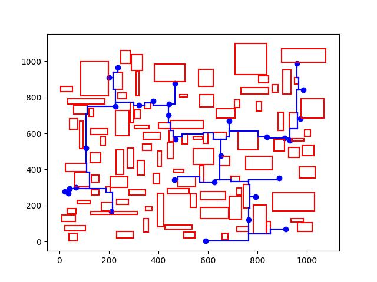

# A Rule-Based High Efficient Obstacle-Avoiding RSMT Algorithm for VLSI Routing

## Overview

This project implements an efficient OARSMT (Obstacle-Avoiding Rectilinear Steiner Minimum Tree) algorithm for VLSI routing applications. The test executable constructs a Steiner tree based on given pin coordinates and obstacle locations while optimizing wirelength and runtime performance.

**Algorithm Source**:  
The core algorithm is from our published paper:  
> J. Guo, H. Kong and L. Feng, "A Rule-Based High Efficient Obstacle-Avoiding RSMT Algorithm for VLSI Routing," *2024 IEEE International Symposium on Circuits and Systems (ISCAS)*, Singapore, 2024, pp. 1-5.  
> DOI: [10.1109/ISCAS58744.2024.10558430](https://doi.org/10.1109/ISCAS58744.2024.10558430)  
> **Contact**: Lang Feng (fenglang3@mail.sysu.edu.cn)

## Files

| File               | Description                                                                 |
|--------------------|-----------------------------------------------------------------------------|
| `test`             | Compiled executable for the OARSMT algorithm (Linux/MacOS binary)           |
| `pins.csv`         | Input: Pin coordinates (format: `x,y` per line)                             |
| `obstacles.csv`    | Input: Rectangular obstacle coordinates (format: `x1,y1,x2,y2` per line)    |
| `tree_results.csv` | Output: Generated Steiner tree edges (format: `x1,x2,y1,y2` per line)       |
| `plotrouting.py`   | Python visualization script                                                 |
| `tree_plot.jpg`    | Example visualization of the output that is generated by plotrouting.py     |

## How to Run

### 1. Execute the Algorithm
```bash
./test pins.csv obstacles.csv
```

**Output**:
- Runtime and total wirelength printed to terminal
- Routing results saved to `tree_results.csv`

### 2. Visualization
```bash
python plotrouting.py
```

## Example Output
  
*Fig. Generated Steiner tree with obstacle avoidance (example)*


